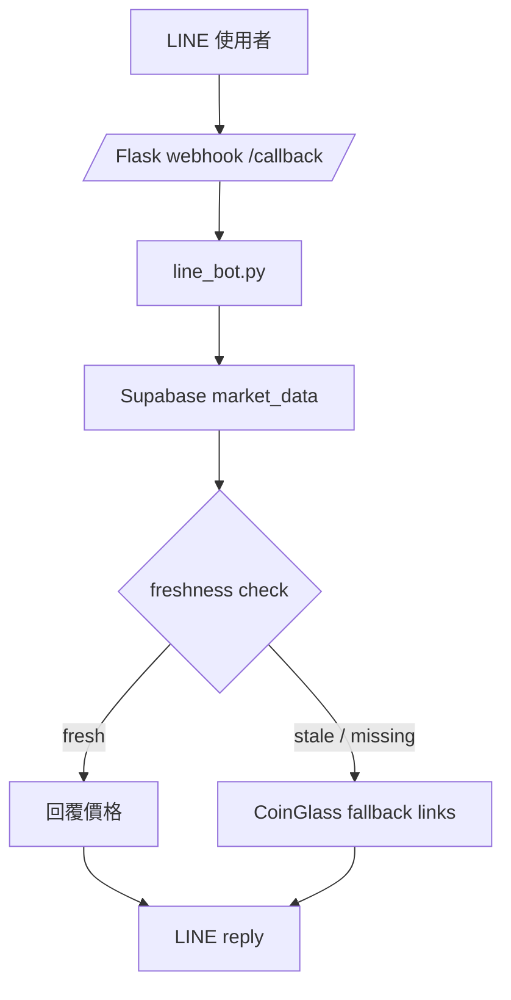
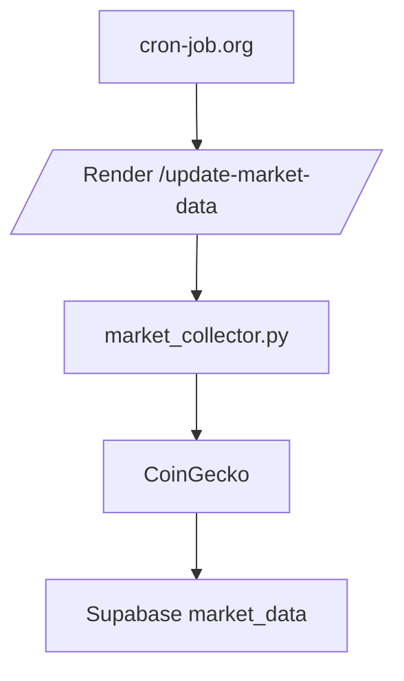
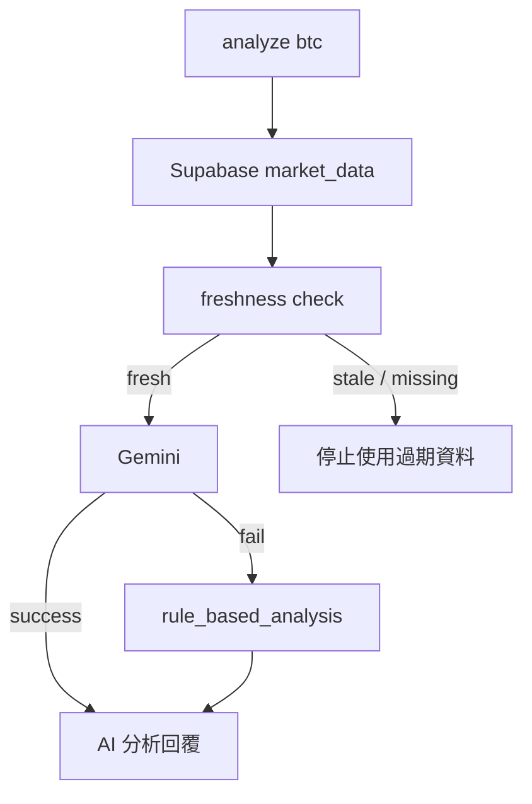

# 系統架構

這個專案是一個 AI Crypto LINE Bot。

它的核心概念很簡單：

1. 使用者在 LINE 傳訊息。
2. Flask 接到 webhook。
3. `line_bot.py` 判斷使用者要查幣價、做分析，還是做其他操作。
4. 系統先查 Supabase。
5. 如果資料新鮮，就直接回覆。
6. 如果資料過期或沒有資料，就走 fallback。
7. AI 分析會先嘗試 Gemini，失敗時改用規則分析。

## 第一條資料流：LINE 查幣價

### 白話說明

這條流程的意思是：

- 使用者在 LINE 輸入幣種，例如 `btc`
- `line_bot.py` 不會去抓 JSON，也不會即時打外部 API
- 它只會先查 Supabase 的 `market_data`
- 如果資料距離現在還在 5 分鐘內，就直接回覆價格
- 如果資料太舊，或根本沒有資料，就不硬回舊價格，而是改回 CoinGlass 連結

### 詳細資料流

1. LINE 將訊息送到 `/callback`
2. Flask 接收 webhook
3. `line_bot.py` 解析訊息內容
4. 程式呼叫 `get_market_data_by_symbol(symbol)`
5. 系統檢查 `updated_at`
6. 用 UTC timezone-aware datetime 判斷 freshness
7. 新鮮資料就回價格
8. 過期或缺資料就回 CoinGlass links
9. LINE Bot 將最後文字回傳給使用者

## 第二條資料流：市場資料更新

### 白話說明

這條流程是背景資料更新，不是使用者查詢流程。

- 外部排程 `cron-job.org` 每 5 分鐘打一次 `/update-market-data`
- `market_collector.py` 去抓 CoinGecko 最新幣價
- 抓到資料後寫入 Supabase `market_data`
- LINE Bot 查詢時只讀 Supabase，不直接碰 CoinGecko

### 詳細資料流

1. `cron-job.org` 觸發 Render 的 `/update-market-data`
2. Flask 進入 `market_collector.py`
3. 程式向 CoinGecko 取得市場資料
4. 組成標準化資料格式
5. 寫入 Supabase `market_data`
6. 更新 `updated_at`
7. 後續 LINE 查詢時直接讀這份資料

## AI 分析流程

### 白話說明

AI 分析不是直接看外部網站，而是先讀 Supabase 內已整理好的市場資料。

- `analyze btc` 先查 Supabase
- 如果資料夠新，再送給 Gemini
- 如果 Gemini 失敗，系統會改用規則分析
- 這樣可以避免 AI 額度不足時功能完全不能用

